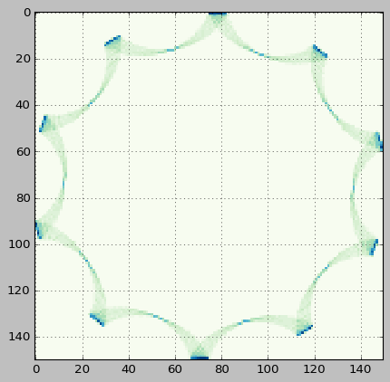
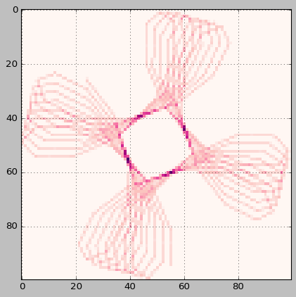
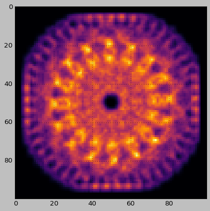

# Attractors
> A small module that provides functions and classes for very efficient simulation and rendering of iterated function systems; dynamical systems, roulette curves, (strange) attractors, and so on.


## Installation

Clone this repository and install with pip or another package manager. Alternatively, just clone/download the repo and use a relative import to include the scripts in your project.

## Dependencies

- Numba
- NumPy
- Matplotlib
- SciPy (optional, only needed for image postprocessing)
- nbdev (if building from source/developing)

## Documentation

A brief overview of the project's main features is given below. For a more comprehensive API reference, documentation of specific classes, and functions, etc., see https://generic-github-user.github.io/attractors/.

## Usage

`attractors` tries to conform to the principle of least astonishment wherever possible (and variable names, classes, parameters etc. aim to be readable), so using the tools should be fairly intuitive.

If we want to make a new `RouletteCurve`, for instance, the following will initialize one with the default parameters (including randomized arm lengths/rotation speeds):

```python
R = RouletteCurve(num_sections=2)
```

Then, we can run simulate and render; function chaining is usually available since most class methods return the class instance ("`self`"):

```python
R.simulate_accelerated(steps=10000).render(mode='hist', hist_args=dict(bins=150))
```


    <matplotlib.image.AxesImage at 0x227b753a910>





Other rendering modes are available; `line` will trace between each generated point.

```python
RouletteCurve(num_sections=2).simulate_accelerated(steps=200).render(mode='line')
```


    <matplotlib.image.AxesImage at 0x227b76a13d0>





A softer render can be achieved using `dist` (and an optional `falloff` value that corresponds to the norm order when generating the brush).

```python
RouletteCurve(num_sections=3).simulate_accelerated(steps=10000).render(mode='dist', falloff=3)
```

    [[0.31748021 0.37475618 0.39893899 0.39893899 0.37475618]
     [0.37475618 0.52913368 0.65863376 0.65863376 0.52913368]
     [0.39893899 0.65863376 1.58740105 1.58740105 0.65863376]
     [0.39893899 0.65863376 1.58740105 1.58740105 0.65863376]
     [0.37475618 0.52913368 0.65863376 0.65863376 0.52913368]]
    


    <matplotlib.image.AxesImage at 0x227bb8fd2e0>





## License

This project is licensed under [GPL v2.0](https://www.gnu.org/licenses/old-licenses/gpl-2.0.en.html). The license file may be viewed [here](https://github.com/generic-github-user/attractors/blob/main/LICENSE.md).

## Tools

`attractors` is built using [nbdev](https://nbdev.fast.ai/) and [Jupyter Lab](https://jupyter.org/), two open-source projects whose developers are owed much credit for making the development process highly efficient and enjoyable.
